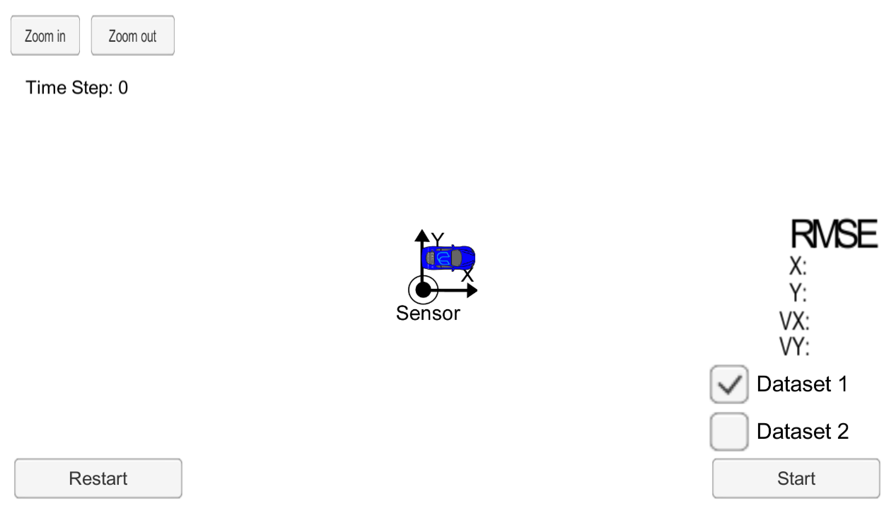
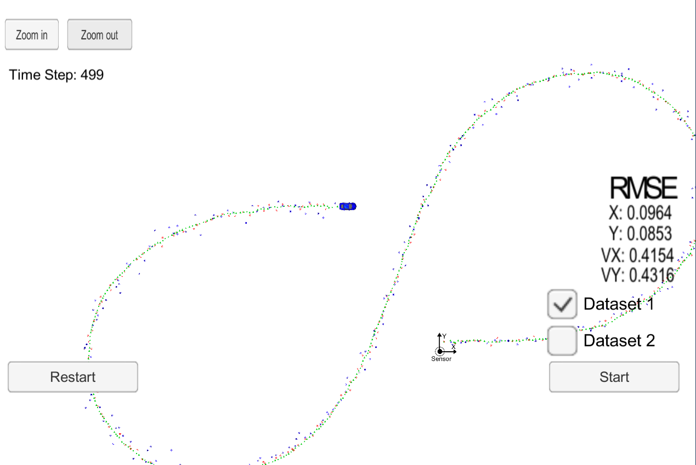
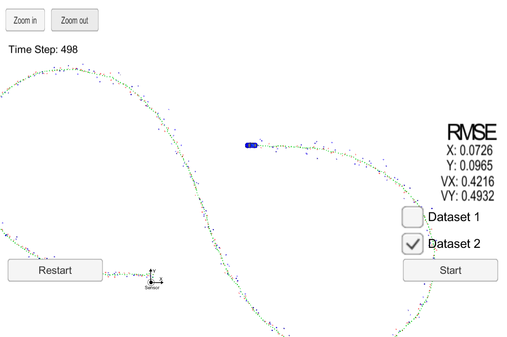
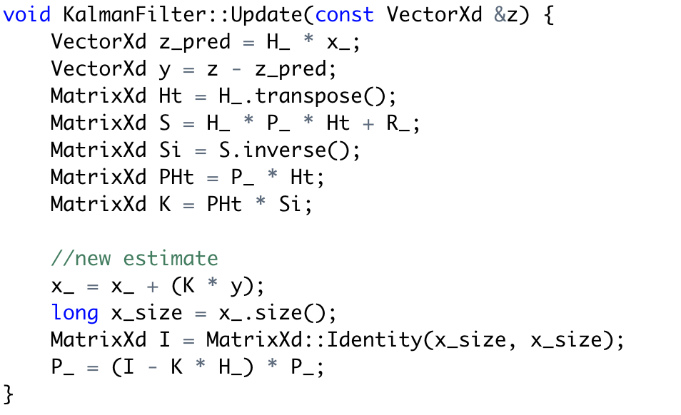
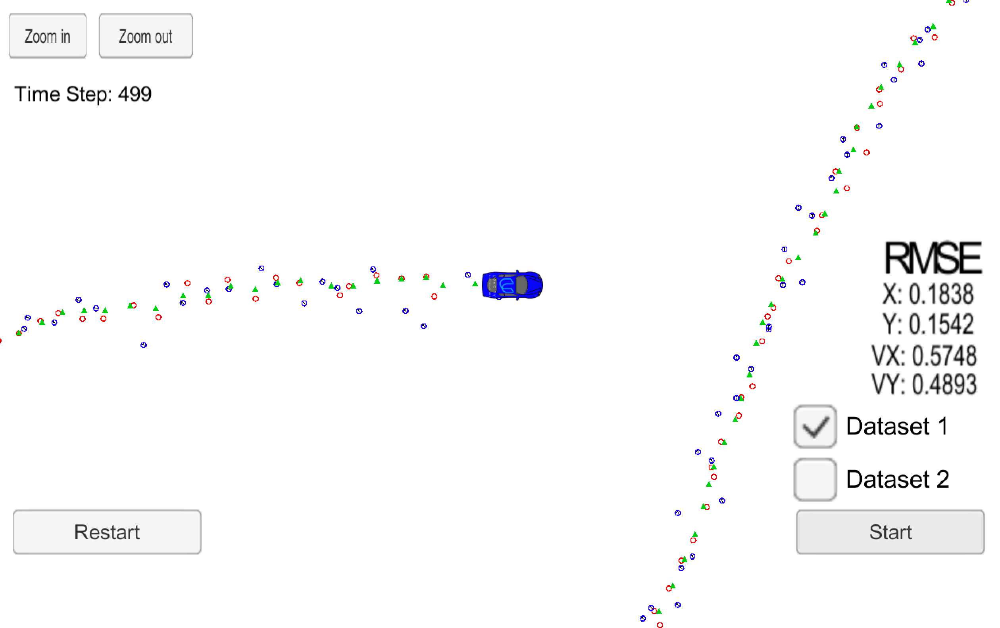
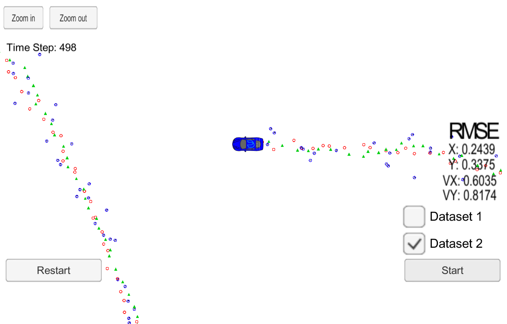
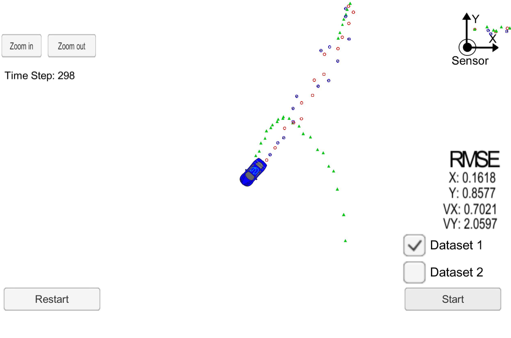

# Extended Kalman Filter Project Starter Code
Self-Driving Car Engineer Nanodegree Program

In this project you will utilize a kalman filter to estimate the state of a moving object of interest with noisy lidar and radar measurements. Passing the project requires obtaining RMSE values that are lower than the tolerance outlined in the project rubric. 

This project involves the Term 2 Simulator which can be downloaded [here](https://github.com/udacity/self-driving-car-sim/releases)

This repository includes two files that can be used to set up and install [uWebSocketIO](https://github.com/uWebSockets/uWebSockets) for either Linux or Mac systems. For windows you can use either Docker, VMware, or even [Windows 10 Bash on Ubuntu](https://www.howtogeek.com/249966/how-to-install-and-use-the-linux-bash-shell-on-windows-10/) to install uWebSocketIO. Please see [this concept in the classroom](https://classroom.udacity.com/nanodegrees/nd013/parts/40f38239-66b6-46ec-ae68-03afd8a601c8/modules/0949fca6-b379-42af-a919-ee50aa304e6a/lessons/f758c44c-5e40-4e01-93b5-1a82aa4e044f/concepts/16cf4a78-4fc7-49e1-8621-3450ca938b77) for the required version and installation scripts.

Once the install for uWebSocketIO is complete, the main program can be built and run by doing the following from the project top directory.

1. mkdir build
2. cd build
3. cmake ..
4. make
5. ./ExtendedKF

After running the terminal will be waiting...

```
Listening to port 4567
Connected!!!
```

And if the simulator is running and connected there will be feedback.

The following is an image of the simulator:



The simulator provides two datasets, wich are the same but read in different order, so the car will move in opposite directions and will began with different sensors.

This is the simulator after running the EKL with dataset 1:



And this after dataset 2:



As you can see, both are under specifications.

# [Rubric](https://review.udacity.com/#!/rubrics/748/view) points

## Compiling

### Your code should compile

I only have made changes to the cpp files, where it was indicated, so there must be no problems.
## Accuracy

### px, py, vx, vy output coordinates must have an RMSE <= [.11, .11, 0.52, 0.52] when using the file: "obj_pose-laser-radar-synthetic-input.txt which is the same data file the simulator uses for Dataset 1"

The EKF accuracy for dataset 1 was: 
px, py, vx, vy RMSE <= [0.0964, 0.0853, 0.4154, 0.4316]

## Following the Correct Algorithm

### Your Sensor Fusion algorithm follows the general processing flow as taught in the preceding lessons.

The Kalman filter implementation can be found [src/kalman_filter.cpp](./src/kalman_filter.cpp) and it is used to predict at [src/FusionEKF.cpp](./src/FusionEKF.cpp#L154) line 154 and to update at lines 172 and 177.

### Your Kalman Filter algorithm handles the first measurements appropriately.

The first measurement is handled at [src/FusionEKF.cpp](./src/FusionEKF.cpp#L79) from line 79 to line 119, only on the first measurement via the use of the variable is_initialized_.

### Your Kalman Filter algorithm first predicts then updates.

The predict operation could be found at [src/FusionEKF.cpp](./src/FusionEKF.cpp#L154) line 154 and to update at lines 172 and 177.

### Your Kalman Filter can handle radar and lidar measurements.

Different type of measurements are handled in two places in [src/FusionEKF.cpp](./src/FusionEKF.cpp):

- For the first measurement from line 79 to line 119.
- For the cycle part from line 166 to 178.

## Code Efficiency

### Your algorithm should avoid unnecessary calculations.

Some redundant calculation has been precalculated, like already made in the course. And many others can be made, like H and Ht, that always value the same because the data has the same time lapse for every sensor, but I suppouse that its better to leave it this way because its more generic.

I have detected another redundant calculus. At the update part of the Kalman Filter, when x_size is calculated, and then the I matrix is created, allways with the same size and the same value. 



But I suppouse that must be done in a way to be generic. I have left it as in the course code.

## Use of only one sensor

### LIDAR.
LIDAR Only gives good accuracy, but not best than fusion.

### RADAR.
RADAR Only give worst accuracy than LIDAR, but still into spec.

There is a condition at  predict operation could be found at [src/main.cpp](./src/main.cpp#L107) line 107 where only one sensor can be defined to update the data.

## Some questions

### Weird behaviour
At the beginning, I copied almost all the code from the course, but I get a weird behaviour from dataset 1.

After the first lap, the values of the predictions went away, and then began to converge, but this gave a bad final result. So I had to change something in the code.

The same didnt occur with the second dataset, so there should be something about the angles.

Looks like phi should stay between -PI and PI, so trying to maintain the angle coming from z between these values should be fine.
Since Z is static, I made these calculations on the final result y.


